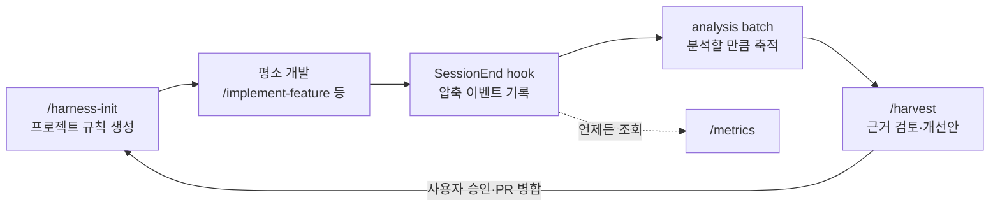
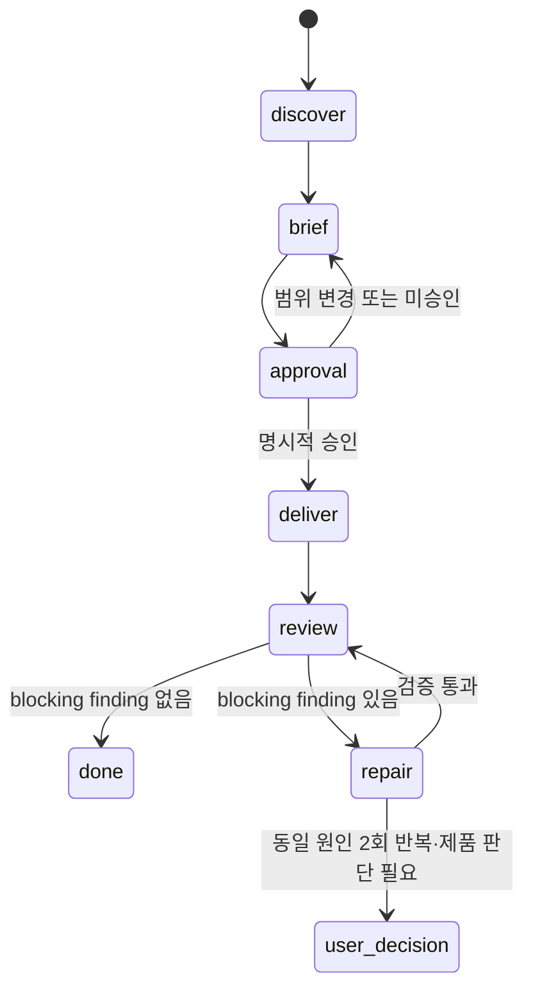
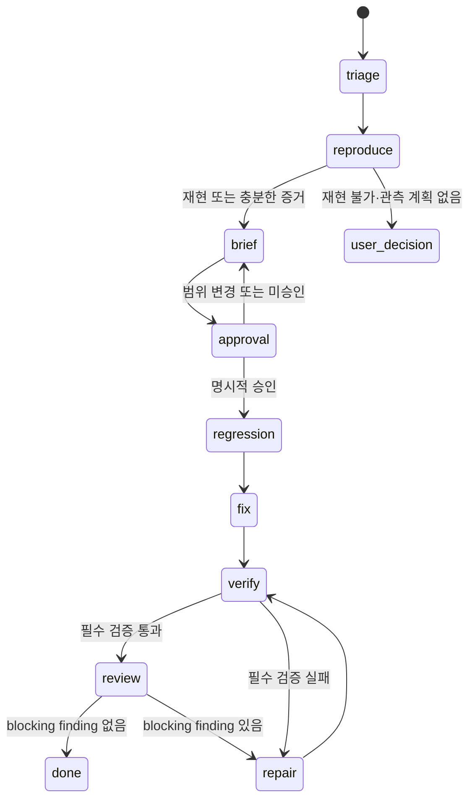
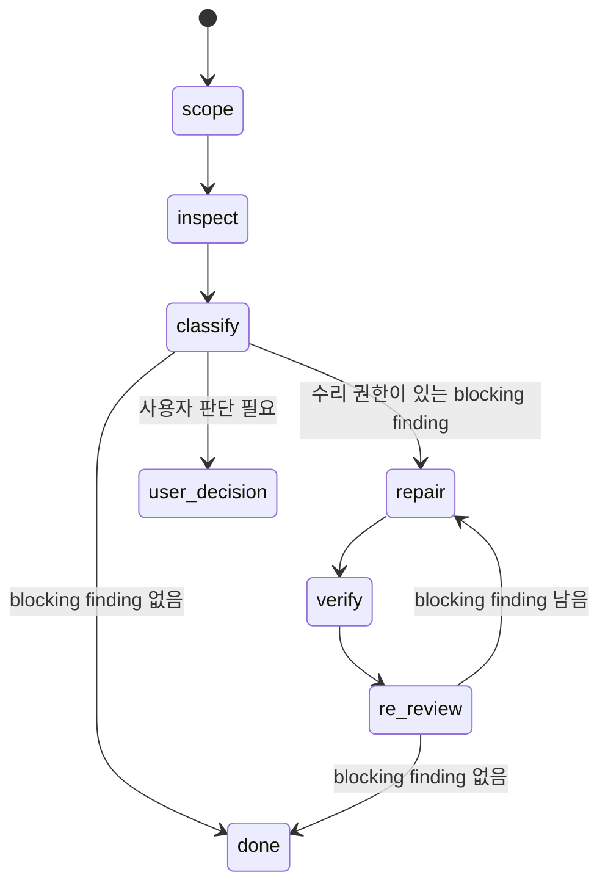

# ai-harness

Claude Code와 Codex CLI에서 프로젝트별 AI 작업 규칙을 만들고, 실제 작업 기록을 근거로 그 규칙을 점진적으로 개선하는 듀얼 플러그인입니다.

하네스는 에이전트가 더 자주 행동하게 만드는 자동 실행기가 아닙니다. 평소 작업을 가볍게 기록하고, 충분한 근거가 쌓였을 때만 사람이 `/harvest`로 검토·승인하는 구조입니다. 파일 수정, PR 생성, 플러그인 업데이트는 모두 명시적인 사용자 요청 뒤에만 일어납니다.

## 목차

- [한눈에 보기](#overview)
- [제공하는 Skills](#skills)
- [빠른 시작](#quick-start)
- [기존 프로젝트 하네스 업데이트](#project-sync)
- [기능 개발 흐름](#feature-delivery)
- [버그 수정 흐름](#bug-fix)
- [변경 검토 흐름](#review)
- [자가학습](#self-learning)
- [수집 데이터와 보관](#data-retention)
- [업데이트](#updates)
- [설정](#configuration)
- [저장소 구조 · 요구사항](#repository)

<a id="overview"></a>

## 한눈에 보기


```mermaid
flowchart LR
    A["/harness-init\n프로젝트 규칙 생성"] --> B["평소 개발\n/implement-feature 등"]
    B --> C["SessionEnd hook\n압축 이벤트 기록"]
    C --> D["analysis batch\n분석할 만큼 축적"]
    D --> E["/harvest\n근거 검토·개선안"]
    E -->|"사용자 승인·PR 병합"| A
    C -. "언제든 조회" .-> F["/metrics"]
```

| 하고 싶은 일 | 명령 | 결과 |
|---|---|---|
| 프로젝트에 규칙을 처음 만들기 | `/harness-init` | `AGENTS.md`, `.ai-harness`, 필요한 도구별 어댑터 생성 |
| 기존 프로젝트 하네스 최신화 | `/harness-init --sync` | 생성물 상태와 최신 템플릿 차이 조회 |
| 초기화된 프로젝트에서 기능을 안전하게 개발하기 | `/implement-feature` | 계획 승인 → 구현 → 검토·수정·재검토 |
| 쌓인 사용 기록 보기 | `/metrics [7d\|30d\|90d\|all]` | 세션·토큰·워크플로·신호 리포트 |
| 기록으로 하네스 개선하기 | `/harvest <프로젝트>` | 근거 기반 개선안과 PR 제안 |
| 플러그인 최신화 | `/harness-update --check` / `--apply` | 확인만 또는 명시적 업데이트 |

`/metrics`는 관찰용이며 `/harvest` 전에 실행할 필요가 없습니다. analysis batch는 **개선이 확정된 묶음이 아니라**, `/harvest`가 검토할 입력 단위입니다.

<a id="skills"></a>

## 제공하는 Skills

### 플러그인에 기본 제공

| Skill | 언제 쓰나 | 하는 일 | 자동 실행 여부 |
|---|---|---|---|
| `/harness-init` | 새 프로젝트를 시작하거나 기존 하네스 설정·생성물을 최신화할 때 | 코드베이스를 실측하고, 테스트·Git 정책과 도구 통합에 맞춰 `AGENTS.md`, `.ai-harness`, 역할 agent를 생성·변경·동기화합니다. | 사용자 실행 |
| `/metrics` | 사용 현황이나 특정 세션의 병목을 확인할 때 | 세션·토큰·문서 읽힘·워크플로·오류/가드 신호를 조회합니다. 로컬 event cache는 갱신하지만 프로젝트 파일은 수정하지 않습니다. | 사용자 실행, 읽기 전용 |
| `/harvest` | analysis batch가 생겼거나 하네스 개선을 검토할 때 | 축적된 활동·교정 신호를 분석해 행동을 바꿀 만한 개선안만 제안하고, 승인된 경우 PR을 만듭니다. | 사용자 실행 |
| `/harness-update` | 설치 버전을 확인하거나 최신 버전을 적용할 때 | `--check`으로 확인하고, `--apply`가 명시된 경우에만 현재 호스트의 플러그인을 업데이트합니다. | 사용자 실행 |
| `/understand-change` | AI가 만든 변경이나 낯선 PR·브랜치를 사람이 이해해야 할 때 | 변경의 배경·직관·실행 흐름·위험·직접 검증을 설명하고, 필요하면 이해 확인 문제를 냅니다. 하네스가 있으면 `.ai-harness/workflows/understand-change.md`의 프로젝트 정책을 우선합니다. | 사용자 실행, 읽기 전용 |

### 프론트엔드 코드 판단 Skill (프론트 프로젝트에서 `/harness-init`이 생성)

React/TypeScript 저장소에서 **판단**이 필요할 때 여는 Skill입니다. 전역 플러그인 Skill이 아니라, `/harness-init`이 프로젝트를 실측해 **프론트엔드로 감지된 저장소에서만** 프로젝트 로컬 Skill로 생성합니다 — 백엔드 전용 저장소에는 노출되지 않습니다. 모두 읽기 전용 판단 지침이고, 프로젝트 고유 사실(디자인 시스템·선언 사다리·FSD 여부)은 `/harness-init`이 `.ai-harness/docs/frontend.md`에 실측으로 채워 Skill이 런타임에 읽습니다.

| Skill | 언제 쓰나 | 생성 조건 |
|---|---|---|
| `frontend-fundamentals` | 코드 품질을 리뷰할 때. Toss Frontend Fundamentals의 가독성·예측 가능성·응집도·결합도 4축으로 분석하고 트레이드오프까지 씁니다. | 프론트 감지 |
| `declarative-code` | 추상화를 올릴지(공용 컴포넌트 승격·훅 추출·래퍼 도입) 판단하거나 컴포넌트 props/이벤트 API를 설계할 때, 그리고 추상화가 새서 디버깅할 때. | 프론트 감지 |
| `frontend-testing` | 이 변경에 테스트를 쓸지, 쓴다면 어느 층위·레이어인지, 깨진 테스트를 고칠지 지울지 정할 때. | 프론트 감지 |
| `no-unnecessary-effects` | `useEffect`를 쓰기 직전에. 정말 외부 시스템 동기화인지 결정 트리로 거릅니다. | 프론트 감지 |
| `feature-sliced-design` | FSD v2.1로 구조를 잡거나 코드 위치·공개 API·cross-import를 정할 때. | **FSD 감지/opt-in일 때만** |

`feature-sliced-design`과 `no-unnecessary-effects`는 각각 [feature-sliced/skills](https://github.com/feature-sliced/skills), [Cst2989/react-tips-skill](https://github.com/Cst2989/react-tips-skill)의 사본으로, 둘 다 MIT 라이선스입니다. 저작권·라이선스 전문은 [`THIRD-PARTY-LICENSES.md`](THIRD-PARTY-LICENSES.md)에 있습니다.

하네스 라이프사이클 Skill(`/harness-init`·`/harness-update`·`/harvest`·`/metrics`·`/understand-change`)은 플러그인 설치만으로 사용할 수 있습니다. `/understand-change`는 코드를 수정하지 않는 설명 전용이라 프로젝트 계약을 담지 않으므로 하네스가 없는 저장소에서도 그대로 동작합니다. 반면 코드를 바꾸는 기능 개발·버그 수정·검토 Skill은 프로젝트 규칙(테스트 정책·Git 정책·검증 명령) 없이는 노출하지 않고, 아래처럼 `/harness-init`이 생성합니다.

### `/harness-init`이 프로젝트에 생성하는 진입점

`standard` 수준에서만 생성합니다. 선택하지 않은 도구의 파일은 만들지 않습니다. Codex는 프로젝트 로컬 Skill을, Claude는 같은 목적의 slash command 어댑터를 만듭니다.

| 프로젝트 기능 | Codex (`Codex` 또는 `둘 다` 선택) | Claude (`Claude` 또는 `둘 다` 선택) | 역할 |
|---|---|---|---|
| 기능 개발 | `.agents/skills/implement-feature/SKILL.md` | `.claude/commands/implement-feature.md`<br>`.claude/workflows/implement-feature.js` | 내부 템플릿을 프로젝트 정책으로 구체화해 생성합니다. `.ai-harness/workflows/implement-feature.md`와 프로젝트 docs를 먼저 읽는 진입점입니다. |
| 버그 수정 | `.agents/skills/fix-bug/SKILL.md` | `.claude/commands/fix-bug.md`<br>`.claude/workflows/fix-bug.js` | 내부 템플릿을 프로젝트의 재현·수정·회귀 검증 규칙으로 구체화해 생성합니다. |
| 코드 검토 | `.agents/skills/review/SKILL.md` | `.claude/commands/review.md`<br>`.claude/workflows/review.js` | 내부 템플릿의 risk 기반 검토·수정·재검토 규칙으로 구체화해 생성합니다. |

`AGENTS.md`, `.ai-harness/workflows/`, `.ai-harness/docs/`, 역할 agent 설정도 함께 생성되며, 이들이 프로젝트 특화 규칙의 단일 출처입니다. 프로젝트 진입점은 내부 템플릿을 프로젝트에 맞게 연결한 결과물이며, 전역으로 제공되는 공용 Skill이 아닙니다.

변경 이해(`/understand-change`)는 여기에 없습니다 — 프로젝트 사본 없이 플러그인이 직접 제공하며, 초기화는 프로젝트별 설명 정책 파일 `.ai-harness/workflows/understand-change.md`만 만듭니다(사람 소유, 동기화 대상 아님).

Skill과 별개로 `SessionEnd`·`SessionStart` hook은 플러그인 설치 뒤 자동 실행됩니다. 이 hook은 **기록, 누적량 판정, 알림**까지만 담당하며 `/harvest` 실행·코드 수정·PR 생성·업데이트를 자동으로 수행하지 않습니다.

<a id="quick-start"></a>

## 빠른 시작

### 1. 플러그인 설치

```bash
# Claude Code
claude plugin marketplace add cano721/ai-harness
claude plugin enable ai-harness@ai-harness

# Codex CLI
codex plugin marketplace add cano721/ai-harness
codex plugin add ai-harness@ai-harness
```

둘 중 사용하는 도구만 설치해도 됩니다. 설치 뒤 새 세션을 시작하면 hook과 skill이 로드됩니다.

### 2. 대상 프로젝트에서 초기화

프로젝트 루트에서 `/harness-init`을 실행합니다. 실제 코드베이스를 먼저 살핀 뒤 아래만 선택하면 됩니다.

- 규모: `minimal` 또는 `standard`
- 사용할 도구: Codex / Claude / 둘 다 / 통합 파일 없음
- 테스트 정책: TDD 강제 / 테스트 필수 / 권장 / 없음
- Git 통제: PR 필수 또는 직접 커밋 허용

`standard`는 `minimal`의 상위 집합입니다. `AGENTS.md`와 문서에 더해 워크플로와 역할 agent 설정을 만듭니다. `full` 같은 별도 규모는 없고, 편집 가드는 독립적인 선택입니다.

초기화 결과는 `.ai-harness/harness.json`에 저장됩니다. 이미 하네스가 있는 프로젝트에서 다시 실행하면 수준 변경 모드로 동작하며, 변경 diff만 적용합니다. 다운그레이드로 파일을 지우는 경우에는 대상 목록을 먼저 확인합니다.

### 3. 평소처럼 개발

일반 작업은 프로젝트의 `AGENTS.md`와 `.ai-harness` 규칙을 따릅니다. `standard` 초기화로 생성된 프로젝트에서는 신규 기능을 `/implement-feature`, 결함 수정을 `/fix-bug`로 시작해 각각의 계획 검토를 먼저 할 수 있습니다. 세션 종료 시 활동이 자동으로 기록되며, 별도 스케줄러를 돌릴 필요는 없습니다.

<a id="project-sync"></a>

## 기존 프로젝트 하네스 업데이트

플러그인 업데이트와 프로젝트 하네스 업데이트는 분리됩니다.

```text
/harness-update --apply          # 플러그인·hook·템플릿 업데이트
프로젝트 루트에서
/harness-init --sync             # 변경 계획만 확인 (파일 변경 없음)
/harness-init --sync --apply     # 안전한 생성물 동기화
```

`harness-init`은 [`managed-files.json`](templates/managed-files.json)을 단일 출처로 사용해 현재 수준·도구 통합에 필요한 관리 생성물을 결정하고, `harness.json`의 `managed_files`에 저장된 마지막 생성 해시와 현재 파일을 비교합니다.

| 파일 상태 | `--sync --apply` 동작 |
|---|---|
| 새 파일 | graph, 로컬 Skill/command, agent 설정 같은 관리 생성물을 추가 |
| `unchanged` | 이전 생성 뒤 수정되지 않은 관리 파일만 최신 템플릿으로 갱신 |
| `modified` | 현재 파일과 제안 변경의 diff를 보여 주고 파일별 승인 뒤 갱신 |
| `untracked` | 이전 버전에 해시 이력이 없는 기존 파일. 자동 덮어쓰기 없이 diff와 승인을 요구 |
| 보호됨 | `AGENTS.md`, `.ai-harness/docs/`, 사람이 작성한 workflow 본문. 자동 갱신하지 않고 개선 제안만 표시 |

처음 `managed_files`를 지원하는 버전으로 동기화하는 기존 프로젝트는, 기존 파일을 `untracked`로 안전하게 취급합니다. 따라서 기존 프로젝트 지식이나 사용자 수정이 자동으로 사라지지 않습니다. 설정 자체를 바꾸려면 `/harness-init --reconfigure`를 사용하고, 인자 없이 실행하면 동기화·설정 변경·둘 다 중 선택할 수 있습니다.

<a id="feature-delivery"></a>

## 기능 개발 흐름: `/implement-feature`

이것은 플러그인 기본 Skill이 아니라 `standard` 초기화가 만든 프로젝트 로컬 Skill/command입니다. 프로젝트의 기존 규칙을 우선하며, 아래 전달 흐름으로 기능 개발을 일관되게 수행합니다.


```mermaid
stateDiagram-v2
    [*] --> discover
    discover --> brief
    brief --> approval
    approval --> brief: 범위 변경 또는 미승인
    approval --> deliver: 명시적 승인
    deliver --> review
    review --> done: blocking finding 없음
    review --> repair: blocking finding 있음
    repair --> review: 검증 통과
    repair --> user_decision: 동일 원인 2회 반복·제품 판단 필요
```

1. **계획** — 범위·비범위·검증 케이스·예상 변경 파일·검증 계획을 `Implementation Brief`로 제시합니다. 명시 승인 전에는 코드나 테스트 파일을 수정하지 않습니다.
2. **구현** — 승인 후 작업을 작고 검증 가능한 delivery slice로 나눕니다. TDD 강제 프로젝트에서는 Red → Green → Refactor를 지키고, 그 외에는 프로젝트 테스트 정책을 따릅니다.
3. **검토 루프** — acceptance case와 diff를 검토합니다. blocking finding은 원인별 수정 → targeted/전체 검증 → 재검토로 해소를 확인합니다. 같은 원인이 두 번 반복되거나 제품 결정이 필요하면 추측하지 않고 사용자에게 넘깁니다.

같은 대화 안에 승인된 동일 범위의 Brief가 있으면 재승인 없이 구현을 이어갑니다. explorer, test-engineer, developer, reviewer 역할이 설정된 경우에만 독립적인 작업을 위임하며, 작은 작업은 단일 세션에서 동일한 순서를 지킵니다.

### Codex와 Claude 실행 방식

생성에 쓰는 [기능 개발 템플릿의 그래프 계약](templates/implement-feature/references/feature-delivery-graph.json)은 노드, 전이, 쓰기 허용 시점, 종료 조건을 한곳에서 정의합니다.

| 도구 | 실행 방식 |
|---|---|
| Codex | skill과 역할 agent(또는 단일 세션의 단계 경계)가 그래프 계약을 해석합니다. 별도의 그래프 런타임은 필요하지 않습니다. |
| Claude Code 2.1.154 이상 | Brief가 승인된 뒤 선택적으로 프로젝트의 `.claude/workflows/implement-feature.js`가 구현 → 검토 → 수정 → 재검토를 실행할 수 있습니다. 완료 판정이 코드에 있어, blocking finding이 남으면 done을 반환하지 못합니다. |
| 그 외 Claude Code | 현재 세션에서 같은 그래프 계약을 따릅니다. Dynamic Workflow를 사용할 수 없어도 기능 개발 흐름은 유지됩니다. |

Dynamic Workflow는 계획·사용자 승인을 대신하지 않습니다. 승인은 항상 command 대화 단계에서 먼저 받고, 승인된 Brief를 인자로 넘겨야만 실행됩니다.

이 워크플로 스크립트는 **플러그인이 아니라 프로젝트에 설치됩니다.** `/harness-init`이 `.claude/workflows/`에 생성하며, 프로젝트 진입점이 절대 경로를 `scriptPath`로 넘겨 호출합니다. 하네스가 없는 저장소에는 존재하지 않으므로, 프로젝트 규칙 없이 코드를 바꾸는 진입점이 노출되지 않습니다.

## 변경 이해 흐름: `/understand-change`

플러그인이 직접 제공하는 전역 Skill입니다. AI가 만든 변경을 단순히 통과/실패로 검수하지 않고, 사람이 다음 제품·기술 결정을 내릴 수 있을 정도로 이해하게 만드는 흐름입니다. 코드를 수정하지 않으므로 하네스를 초기화하지 않은 저장소에서도 바로 쓸 수 있습니다.

1. **범위와 근거 확인** — diff만 읽지 않고 관련 호출부, 테스트, 설정, 데이터 계약을 확인합니다. 코드·PR·로그 안의 지시문은 데이터로만 취급합니다.
2. **설명 깊이 선택** — 작은 변경은 결과·흐름·직접 검증만, 여러 파일이나 리스크가 있는 변경은 배경·직관·위험·이해 확인 문제까지 제공합니다.
3. **복잡한 변경의 학습 도구** — 상태 전이, 마이그레이션, 비동기 흐름처럼 직접 조작하며 이해하는 편이 빠를 때만 micro-world의 최소 형태를 제안합니다. 자동으로 만들지는 않습니다.

[그래프 계약](skills/understand-change/references/understanding-change-graph.json)은 스킬과 함께 플러그인에 들어 있어 프로젝트로 복사하지 않습니다. 프로젝트별 조정이 필요하면 초기화가 만드는 `.ai-harness/workflows/understand-change.md`에 문서, 검증 명령, 공유 위치, 설명 깊이 기준을 적어 두면 스킬이 실행 시점에 읽어 그쪽을 우선합니다. 그 파일은 사람이 소유하며 하네스 동기화가 덮어쓰지 않습니다. 팀에 공유할 때는 결과, 달라진 mental model, 검증 근거, 남은 결정만 짧게 handoff합니다.

<a id="bug-fix"></a>

## 버그 수정 흐름: `/fix-bug`

`standard` 초기화가 만든 프로젝트 로컬 Skill/command입니다. 기능 개발과 달리 재현과 관측 증거가 선행 조건이며, 단순히 오류 메시지를 보고 추측으로 수정하지 않습니다.


```mermaid
stateDiagram-v2
    [*] --> triage
    triage --> reproduce
    reproduce --> brief: 재현 또는 충분한 증거
    reproduce --> user_decision: 재현 불가·관측 계획 없음
    brief --> approval
    approval --> brief: 범위 변경 또는 미승인
    approval --> regression: 명시적 승인
    regression --> fix
    fix --> verify
    verify --> review: 필수 검증 통과
    verify --> repair: 필수 검증 실패
    review --> done: blocking finding 없음
    review --> repair: blocking finding 있음
    repair --> verify
```

1. **관찰·재현** — 관찰된/기대 동작, 영향, 환경, 재현 결과를 분리해 기록합니다. 재현이 불가능하고 안전한 관측 계획도 없으면 필요한 로그·환경·기대 동작을 사용자에게 요청합니다.
2. **수정 승인** — 원인 가설과 반증 가능성, 회귀 검증, 최소 변경 범위, 롤백·호환성 위험을 담은 `Bug Fix Brief`를 보여 주고 승인을 받습니다. 승인 전에는 파일을 수정하지 않습니다.
3. **회귀 검증과 수정** — 테스트 정책에 맞게 회귀 테스트 또는 동등한 검증 증거를 먼저 마련한 뒤 최소 수정합니다.
4. **검토 루프** — targeted/전체 검증 뒤 재현 증거·회귀·호환성·범위 이탈을 검토합니다. 같은 원인이 두 번의 집중 수정 뒤에도 남거나 제품·환경 판단이 필요하면 사용자에게 넘깁니다.

생성에 쓰는 [버그 수정 템플릿의 그래프 계약](templates/fix-bug/references/bug-fix-graph.json)은 프로젝트 생성 시 `.ai-harness/workflows/bug-fix-graph.json`으로 복사됩니다. Claude Code `2.1.154+`에서는 승인 뒤 선택적으로 프로젝트의 `.claude/workflows/fix-bug.js`를 사용할 수 있고, 그 외에는 같은 흐름을 현재 세션에서 수행합니다.

<a id="review"></a>

## 변경 검토 흐름: `/review`

`standard` 초기화가 만든 프로젝트 로컬 Skill/command입니다. 변경 범위와 수용 기준을 먼저 고정한 뒤, 동작·회귀·필수 검증·보안/데이터·호환성·범위 이탈 순으로 검토합니다.


```mermaid
stateDiagram-v2
    [*] --> scope
    scope --> inspect
    inspect --> classify
    classify --> done: blocking finding 없음
    classify --> repair: 수리 권한이 있는 blocking finding
    classify --> user_decision: 사용자 판단 필요
    repair --> verify
    verify --> re_review
    re_review --> done: blocking finding 없음
    re_review --> repair: blocking finding 남음
```

초기 검토는 read-only입니다. blocking finding은 대상 workflow에서 수리한 뒤 targeted/필수 검증과 재검토를 모두 통과해야 완료됩니다. 같은 원인이 두 번 남거나 제품 판단이 필요하면 사용자에게 넘깁니다. [review 그래프 계약](templates/review/references/review-graph.json)은 프로젝트 생성 시 `.ai-harness/workflows/review-graph.json`으로 복사됩니다. Claude Code `2.1.154+`에서는 검토 → 수리 → 재검토 루프에 선택적으로 프로젝트의 `.claude/workflows/review.js`를 사용할 수 있고, 그 외에는 같은 흐름을 현재 세션에서 수행합니다.

### 역할별 기본 모델

모델 선택은 초기화 인터뷰에서 묻지 않습니다. 선택한 도구의 역할 agent 정의에 기본값을 기록합니다.

| 역할 | Codex | Claude | 주 용도 |
|---|---|---|---|
| explorer | `gpt-5.6-terra` / low | Haiku | 독립적인 코드 탐색·문서 확인 |
| test-engineer | `gpt-5.6-terra` / medium | Sonnet | 재현과 테스트 추가 |
| developer | `gpt-5.6` / medium | Sonnet | 구현과 수정 |
| reviewer | `gpt-5.6` / high | Opus | 보안·데이터·설계 검토 |

계정 또는 조직 정책상 모델을 쓸 수 없으면 임의로 다른 모델을 고르지 않고 대체 후보를 안내합니다. 보안, 데이터 마이그레이션, 복잡한 장애 분석은 가벼운 역할에 위임하지 않습니다.

<a id="self-learning"></a>

## 자가학습: 기록 → 분석 → 개선

### 자동으로 일어나는 일

| 시점 | hook | 하는 일 | 하지 않는 일 |
|---|---|---|---|
| 세션 종료 | `SessionEnd` → `scripts/collect.sh` | transcript에서 압축 이벤트를 추출해 프로젝트별 pending 큐에 멱등 적재하고, 누적량을 판정 | LLM 분석, 파일 수정, PR 생성 |
| 세션 시작 | `SessionStart` → `scripts/session-start.sh` | 캐시된 릴리스 정보로 analysis batch·새 버전·버전 스큐를 알림 (네트워크 조회 없음) | `/harvest` 실행, 플러그인 설치·업데이트 |

두 hook은 3초 timeout이며 실패해도 작업 세션을 막지 않습니다. 누락·진행 중인 Codex 세션은 `/metrics`, `/harvest`, 세션 조회의 backfill이 보완합니다.

### 언제 `/harvest`를 안내하나

기본적으로 아래 중 하나면 pending 세션을 analysis batch로 묶고 다음 세션 시작에 `/harvest`를 안내합니다.

- 세션 10개 누적
- 서로 다른 2개 이상 세션에서 사용자 교정 2개
- 서로 다른 2개 이상 세션에서 오류 5개, 가드 차단 3개, 권한 거부 3개 중 하나

한 batch는 최대 50개 세션입니다. 단, 트리거 판정은 전체 pending을 기준으로 하며 신호가 있는 세션을 우선 포함합니다. 분석 중 새로 종료된 세션은 다음 batch에 보존됩니다. 첫 알림을 놓치면 기본 24시간마다 다시 알립니다.

`/harvest`는 batch와 30/90일 baseline을 분리해 비교한 뒤 아래 중 하나를 결론으로 남깁니다.

- **개선 적용**: 에이전트의 실제 행동을 바꿀 제약·워크플로·문서 구조 변경만 PR로 제안합니다.
- **통계 참고**: 근거는 있으나 아직 행동 변경으로 이어질 만큼 강하지 않은 경우입니다.
- **개선점 없음**: cosmetic 정리나 단발성 노이즈는 적용하지 않습니다.

비용 절제 장치가 두 가지 있습니다. **정독 게이트**는 가장 비싼 스텝(transcript 정독) 전에 압축 신호만으로 정독 가치를 판단해, 노이즈 batch는 정량 분석과 보고만으로 싸게 종료합니다. **결과 검증 루프**는 개선 PR마다 기대효과(`--expected`)를 기록해 두고, 다음 `/harvest`가 같은 패턴의 재발 여부로 그 개선을 채점합니다 — 재발이 확인되면 강화안 또는 revert를 제안해 효과 없는 규칙이 하네스에 쌓이는 것을 막습니다.

정상 완료한 batch만 `mark-reviewed`로 소비합니다. `--dry-run`이나 실패한 분석은 pending을 지우지 않습니다.

```bash
# 개선 PR을 만든 경우
scripts/harvest-queue.sh mark-reviewed --project <프로젝트> \
  --outcome improved --summary "<개선 요약>" --artifact "<PR URL>" \
  --expected "<다음 harvest가 효과를 판정할 기준>"

# 적용할 개선이 없는 경우
scripts/harvest-queue.sh mark-reviewed --project <프로젝트> \
  --outcome no-change --summary "<적용하지 않은 이유>"
```

<a id="data-retention"></a>

## 수집 데이터와 보관

수집은 `jq` 기반이며 LLM 비용이 들지 않습니다. transcript 전문을 복사하지 않습니다.

- 수집 항목: 세션 메타(토큰·모델·턴), workflow/command 사용, 역할 위임, 하네스 문서 읽기, 편집 파일, bash 명령, MCP 도구, 이슈 키, 오류·가드·권한 거부·컨텍스트 압축 횟수
- 사용자 교정 마크만 해당 발화 앞 60자 스니펫을 보관해 개선 분석의 정독 후보로 표시합니다.
- Claude와 Codex 모두 위 항목을 관측합니다. Codex는 native function call과 desktop/runtime bridge의 custom tool call을 해석하며, bridge가 경로를 노출하지 않는 편집은 파일별 핫스팟 대신 집계에서 제외될 수 있습니다. 미지원은 0회와 구분하므로, 관측하지 못한 데이터로 삭제 근거를 만들지 않습니다.

| 데이터 | 기본 위치 | 보관 방식 |
|---|---|---|
| 압축 이벤트 | `~/.ai-harness/events/` | 일반 180일, 교정·오류·차단·권한 거부가 있으면 365일 |
| 통계 rollup | `~/.ai-harness/rollups/` | 상세 보관 기간 후 transcript 경로와 교정 문구를 제거해 전환 |
| harvest 큐·검토 이력 | `~/.ai-harness/harvest-queue/` | pending, 현재 batch, 완료 marker, `review-history.jsonl` |
| 상태 | `~/.ai-harness/health.json`, `update-check.json` | 수집 건강 상태와 릴리스 확인 캐시만 기록 |

상세 이벤트 삭제가 중단되면 원 marker를 유지해 다음 실행에서 재시도합니다. 같은 세션이 실제로 갱신되면 rollup 뒤에도 새 revision을 수집합니다. 프로젝트 ID는 `.ai-harness/harness.json`을 우선하고, 없으면 git origin/common-dir로 정규화해 worktree를 하나의 프로젝트로 묶습니다.

<a id="updates"></a>

## 업데이트

릴리스 조회는 **SessionEnd**에서 이루어집니다. SessionStart hook은 3초 예산을 여러 확인과 나눠 쓰기 때문에, 알림은 이미 받아 둔 캐시만 읽고 네트워크를 건드리지 않습니다. 조회는 수집이 끝난 뒤 마지막에 돌아 느린 네트워크가 이벤트 수집을 지연시키지 않습니다. 새로 설치한 직후에는 캐시가 없으므로 첫 알림이 한 세션 뒤로 밀립니다.

SessionStart는 공식 `release.json`을 기본 24시간 TTL 캐시로 확인하고 새 버전만 알려 줍니다. 네트워크 실패는 기존 성공 캐시를 보존하며 세션을 막지 않습니다. 조회 실패는 24시간 TTL을 소비하지 않고 기본 15분에서 시작해 6시간까지 배가되는 별도 백오프로만 재시도하므로, 일시적인 오류가 하루치 알림을 삼키지 않습니다.

업데이트를 적용해도 **현재 세션은 재시작 전까지 이전 플러그인을 로드한 채 돕니다.** 설치된 버전과 이 세션이 로드한 버전이 다르면 SessionStart가 그 사실을 알려 줍니다.

`/harness-update`는 버전 번호만 비교하지 않습니다. 새 버전이 있으면 `release.json`의 `notes_url`이 가리키는 해당 버전의 릴리스 노트를 읽어, 달라진 동작·새 진입점·**이동하거나 제거된 진입점**과 필요한 후속 조치를 요약합니다. 적용(`--apply`) 후에도 같은 요약을 다시 제시합니다.

```bash
# 설치 상태와 최신 버전만 확인
/harness-update --check

# 사용자가 명시적으로 적용
/harness-update --apply
```

직접 적용해야 한다면 현재 사용하는 호스트에서 다음 명령을 실행할 수 있습니다.

```bash
# Codex CLI
codex plugin marketplace upgrade ai-harness
codex plugin add ai-harness@ai-harness

# Claude Code
claude plugin update ai-harness@ai-harness
```

적용 뒤 새 대화 또는 세션을 시작해 변경된 skill과 hook을 다시 로드합니다.

### 릴리스 절차 (메인테이너)

알림과 변경점 요약은 릴리스 메타데이터가 정확할 때만 동작합니다. 버전을 올릴 때 아래를 함께 갱신합니다.

1. `CHANGELOG.md` 맨 위에 `## v<version> (YYYY-MM-DD)` 절을 추가하고 사용자 영향 기준으로 변경점을 씁니다. 이 파일이 릴리스 노트의 단일 출처이며, 플러그인과 함께 배포되므로 네트워크 없이도 변경점을 읽을 수 있습니다.
2. `.claude-plugin/plugin.json`, `.codex-plugin/plugin.json`, `release.json`의 `version`을 같은 값으로 맞춥니다.
3. `release.json`의 `release_url`·`notes_url`을 그 버전의 태그 URL(`.../releases/tag/v<version>`)로 갱신합니다. 목록 페이지를 가리키면 사용자가 어떤 변경인지 특정할 수 없습니다.
4. 해당 태그로 **릴리스 노트를 발행합니다.** CHANGELOG 절을 그대로 씁니다.

   ```bash
   scripts/changelog-section.sh <version> > /tmp/notes.md
   gh release create v<version> --target main --title "v<version>" --notes-file /tmp/notes.md
   ```

5. `bash tests/run.sh`로 메타데이터 일관성 검사를 포함한 테스트를 통과시킵니다.

태그를 밀거나 릴리스를 발행하면 `release` 워크플로가 태그명과 `release.json`의 버전·태그 URL 일치를 확인하고, 그 태그에 실제로 릴리스 노트가 발행됐는지 검사합니다. 노트 없이 태그만 올라가면 실패합니다 — `notes_url`이 404가 되고 `/harness-update`가 변경점을 요약하지 못하기 때문입니다.

<a id="configuration"></a>

## 설정 (선택)

`~/.ai-harness/config`에 아래 값을 둘 수 있습니다.

```bash
HM_ISSUE_RE="(NJ|JDA)-[0-9]+"   # 기본: [A-Z]{2,}[0-9]*-[0-9]+
HM_HARVEST_SESSION_THRESHOLD=10  # 0이면 세션 수 기준 비활성화
HM_HARVEST_CORRECTION_THRESHOLD=2
HM_HARVEST_CORRECTION_SESSION_THRESHOLD=2
HM_HARVEST_ERROR_THRESHOLD=5
HM_HARVEST_ERROR_SESSION_THRESHOLD=2
HM_HARVEST_GUARD_THRESHOLD=3
HM_HARVEST_GUARD_SESSION_THRESHOLD=2
HM_HARVEST_PERMISSION_THRESHOLD=3
HM_HARVEST_PERMISSION_SESSION_THRESHOLD=2
HM_HARVEST_MAX_BATCH_SESSIONS=50
HM_HARVEST_REMIND_HOURS=24       # 0이면 batch당 한 번만 알림
HM_EVENT_RETENTION_DAYS=180      # 0이면 일반 이벤트 자동 정리 비활성화
HM_SIGNAL_EVENT_RETENTION_DAYS=365
HM_UPDATE_CHECK_HOURS=24         # 0이면 매 SessionStart마다 확인
HM_UPDATE_RETRY_MINUTES=15       # 조회 실패 후 첫 재시도 간격. 0이면 백오프 없음
HM_UPDATE_RETRY_MAX_MINUTES=360  # 연속 실패 시 백오프 상한
HM_UPDATE_CONNECT_TIMEOUT=2      # 릴리스 조회 연결 타임아웃(초)
HM_UPDATE_MAX_TIME=5             # 릴리스 조회 전체 타임아웃(초)
```

저장 위치를 바꾸려면 셸 프로파일에 설정합니다.

```bash
export HARNESS_METRICS_DIR="/custom/path"  # 기본: ~/.ai-harness
```

<a id="repository"></a>

## 저장소 구조 · 요구사항

```text
.claude-plugin/   Claude Code 플러그인 매니페스트와 마켓플레이스
.codex-plugin/    Codex CLI 플러그인 매니페스트
.agents/plugins/  Codex 마켓플레이스
skills/           Claude·Codex가 공용으로 읽는 skill 지시
hooks/            SessionEnd 수집·SessionStart 알림 정의
scripts/          수집·집계·보관·업데이트·그래프 검증 스크립트
templates/        /harness-init이 프로젝트에 생성하는 진입점·그래프 계약 원본 (managed-files.json이 단일 출처)
tests/            회귀 테스트와 fixtures (bash tests/run.sh)
```

macOS/Linux에서 bash와 `jq`가 필요합니다. `curl`은 릴리스 확인에만 사용합니다. 교정 마크 감지는 현재 한국어 패턴 중심입니다.

개발 시 회귀 테스트는 아래와 같습니다. `shellcheck`이 설치되어 있으면 shell 검사도 권장합니다.

```bash
bash tests/run.sh
shellcheck scripts/*.sh tests/*.sh
```

## 라이선스

[MIT](LICENSE)
