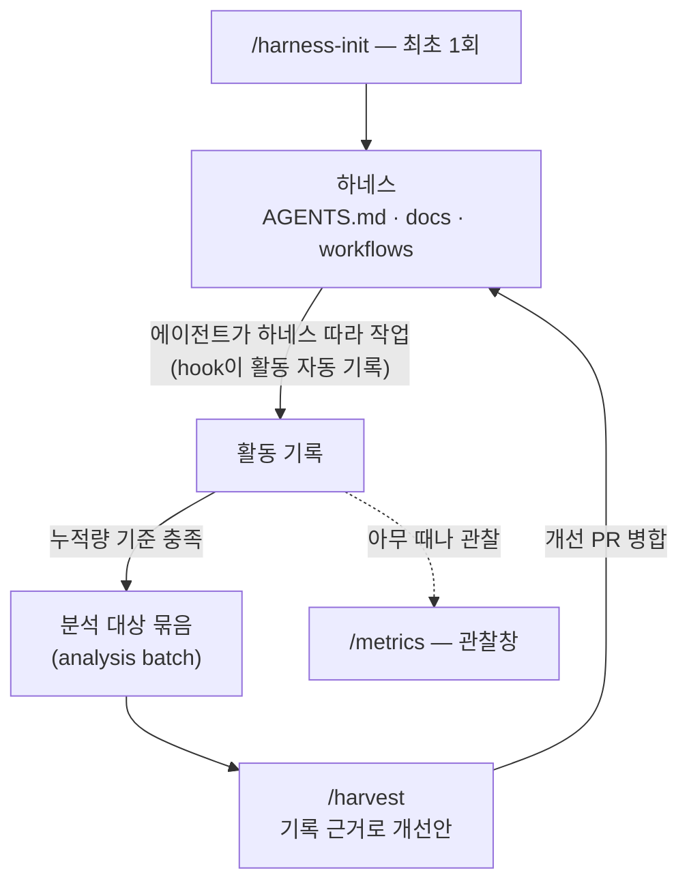

# ai-harness

에이전트 활동 기록 기반 하네스 자동 개선 — Claude Code · Codex CLI 듀얼 플러그인.

에이전트가 프로젝트에서 실제로 어떻게 일하는지(어떤 문서를 읽고, 어떤 워크플로를 쓰고, 어디서 반복 실수하는지)를 자동 수집하고, 그 데이터로 프로젝트 하네스(AGENTS.md, docs, workflows)를 근거 기반으로 개선한다.

## 설치

```bash
# Claude Code
claude plugin marketplace add cano721/ai-harness
claude plugin enable ai-harness@ai-harness

# Codex CLI
codex plugin marketplace add cano721/ai-harness
codex plugin add ai-harness@ai-harness
```

설치 즉시 세션 활동 수집이 시작된다. SessionEnd hook으로 전달된 Claude/Codex transcript를 즉시 소화하고, 누락되거나 진행 중인 Codex 세션 로그는 `/metrics`·`/harvest`·session 조회 시점의 backfill이 보완한다. 프로젝트별 누적량이 기준을 넘으면 다음 세션 시작 때 `/harvest`를 안내한다. SessionStart는 새 ai-harness 릴리스도 확인하지만, 업데이트는 사용자가 명시적으로 실행할 때만 적용한다.

## 라이프사이클


```mermaid
flowchart TD
    I["/harness-init — 최초 1회"] --> H["하네스<br/>AGENTS.md · docs · workflows"]
    H -->|"에이전트가 하네스 따라 작업<br/>(hook이 활동 자동 기록)"| R["활동 기록"]
    R -->|"누적량 기준 충족"| Q["분석 대상 묶음<br/>(analysis batch)"]
    Q --> V["/harvest<br/>기록 근거로 개선안"]
    V -->|"개선 PR 병합"| H
    R -.->|"아무 때나 관찰"| M["/metrics — 관찰창"]
```

쓸수록 하네스가 좋아지는 루프: 셋업(1회) → 평소 작업이 자동 기록됨 → 기록을 근거로 하네스를 고침 → 좋아진 하네스로 다시 작업.

`/metrics`는 루프 단계가 아니라 **관찰창** — 쌓인 기록을 사람이 보고 싶을 때 아무 때나 친다. `/harvest`는 필요한 통계를 스스로 갱신하므로 `/metrics` 선행이 필요 없다.

### /harness-init

프로젝트를 실측 분석(언어·빌드·테스트·git 컨벤션·모듈 구조)한 뒤 **수준 인터뷰**를 거쳐 하네스를 스캐폴딩한다:

- **규모**: `minimal`(AGENTS.md+docs) / `standard`(+워크플로·페르소나). 선택한 도구의 진입점은 아래 통합 선택에 따라 추가되며, 편집 가드는 `full` 같은 별도 단계가 아니라 독립 옵션
- **도구 통합**: Codex / Claude / 둘 다 / 통합 파일 없음. Codex는 `.agents/skills/`, Claude는 `.claude/` 어댑터를 필요한 경우에만 생성
- **agent 모델 기본값**: 사용자가 고르는 항목이 아니다. 선택한 도구의 agent 정의에 역할별 모델·사고 수준을 직접 기록하고, 사용 불가 시에만 대체 후보를 제시
- **테스트 정책**: TDD 강제 / 테스트 필수 / 권장 / 없음 — 실측과 모순되면 경고 (예: 테스트 0개인데 TDD 강제)
- **git 통제**: PR 필수(병합은 사람) / 직접 커밋 허용

선택은 `.ai-harness/harness.json`에 기록된다. docs 초안은 코드 실측으로만 채우고, Hard constraints는 빈 틀로 시작한다 — 검증된 지식은 `/harvest`가 시간을 들여 채운다.

#### agent 모델 기본값

모델은 인터뷰로 묻지 않고, 선택한 도구의 역할 agent 설정에 직접 생성한다. Codex는 `.codex/agents/*.toml`의 `model`·`model_reasoning_effort`, Claude는 `.claude/agents/*.md`의 `model` frontmatter를 사용한다.

| 역할 | Codex | Claude | 용도 |
|---|---|---|---|
| explorer | `gpt-5.6-terra` / low | Haiku | 독립적인 코드 탐색·문서 확인 |
| test-engineer | `gpt-5.6-terra` / medium | Sonnet | 재현과 테스트 추가 |
| developer | `gpt-5.6` / medium | Sonnet | 구현과 수정 |
| reviewer | `gpt-5.6` / high | Opus | 보안·데이터·설계 검토 |

보안, 데이터 마이그레이션, 복잡한 장애 분석은 explorer/test-engineer에 맡기지 않고 developer 또는 reviewer로 승격한다. agent 모델이 계정·조직 정책상 사용 불가하면 자동으로 다른 모델을 고르지 않고 오류와 대체 후보를 보여 준다. 서브에이전트는 각각 별도 컨텍스트·도구 작업을 소비하므로, 독립적이고 읽기 위주의 작업에만 위임한다.

**기존 하네스에서 재실행하면 수준 변경 모드**: 현재 수준을 보여주고 재인터뷰 후 diff만 적용한다. 업그레이드는 자동, 다운그레이드(삭제)는 대상 목록 확인 후에만.

### 자동 수집

세션 transcript를 압축 이벤트(JSONL)로 적재한다. LLM 비용 0 — `jq`만 사용.

수집 항목: 세션 메타(토큰·모델·턴), 워크플로/커맨드 사용, 페르소나 위임, 하네스 docs 읽힘, 편집 파일, bash 명령, MCP 툴, 이슈 키 언급, 에러/가드 차단/권한 거부/컨텍스트 압축 횟수, 사용자 교정 마크(해당 발화의 앞 60자 스니펫 — 개선 분석의 정독 후보 표시용).

각 session 이벤트는 `coverage`에 실제 관측 가능한 항목을 기록한다. 현재 Claude는 위 항목 전체, Codex는 bash 명령·이슈·교정 마크를 관측한다. 통계에서 **미지원은 0회와 구분**하며 `/harvest`의 삭제 근거로 쓰지 않는다.

#### 등록된 hook

| hook | 실행 명령 | 역할 |
|---|---|---|
| `SessionEnd` | `scripts/collect.sh` | transcript를 source별 압축 이벤트로 추출하고 프로젝트 pending 큐에 멱등 적재한다. 누적량만 판정하며 LLM이나 `/harvest`는 실행하지 않는다. |
| `SessionStart` | `scripts/session-start.sh` | 현재 프로젝트의 analysis batch 알림과 ai-harness 새 버전 알림을 하나로 합친다. `/harvest` 분석이나 플러그인 업데이트를 자동 시작하지 않는다. |

두 hook 모두 timeout은 3초이며, 수집·알림 실패가 세션 시작이나 종료를 막지 않도록 실패 안전하게 동작한다.

#### 누적량 기반 harvest 트리거

SessionEnd hook은 LLM 분석을 실행하지 않고, 막 끝난 세션의 압축 이벤트를 프로젝트별 pending 큐에 멱등 적재한 뒤 누적량만 판정한다. 누락된 hook은 다음 backfill이 이벤트 복원과 큐 등록을 함께 수행한다. 이미 검토한 Claude/Codex 세션을 같은 ID로 재개한 경우에는 event revision 변화를 감지해 새 review unit으로 넣고, 교정·오류 같은 신호는 이전 검토 이후 증가분만 계산한다.

기본 트리거는 **세션 10개**, 또는 **서로 다른 2개 이상 세션에서** 사용자 교정 2개 / 오류 5개 / 가드 차단 3개 / 권한 거부 3개 중 하나를 충족하는 경우다. 단일 세션 노이즈가 바로 분석을 만들지 않게 하면서 반복 신호는 놓치지 않는다. 한 analysis batch는 최대 50개 세션으로 제한하며, cap 뒤의 신호가 가려지지 않도록 전체 pending으로 트리거를 판정하고 신호가 있는 review unit을 batch에 우선 포함한다.

analysis batch는 **개선이 필요하다는 판정 결과가 아니라 `/harvest`가 검토할 입력 묶음**이다. `/harvest`가 반복성·근거·행동 변화 가치를 분석한 뒤 개선 적용, 통계 참고만, 개선점 0건 중 하나로 판단한다. 종료 훅에서는 파일 수정·PR 생성이나 LLM 호출을 하지 않는다.

분석 도중 새로 끝난 세션은 현재 analysis batch에 섞지 않고 다음 묶음용 pending으로 보존한다. record·import·batch 생성·`mark-reviewed`는 프로젝트별 공용 lock으로 직렬화해 hook이 겹쳐도 marker가 pending과 seen으로 갈라지지 않는다. 정상 분석 완료 시 `mark-reviewed`로 현재 묶음만 처리 완료 표시하며, `--dry-run`이나 실패한 분석은 소비하지 않는다. 첫 알림을 놓치면 기본 24시간 간격으로 다시 안내한다.

큐 상태 JSON에서 `has_analysis_batch`는 현재 분석할 묶음이 있는지, `new_analysis_batch`는 이번 명령에서 새 묶음이 만들어졌는지를 뜻한다. 고정된 묶음은 `analysis-batch.json`에 저장되고 `/harvest`가 정상 완료되면 `mark-reviewed` 명령으로 검토 완료 처리한다.

#### 플러그인 업데이트

SessionStart는 공식 `release.json`을 기본 24시간 캐시로 확인한다. 새 버전이 있으면 세션 메시지로만 알려 주며, hook이 설치·재시작·프로젝트 파일 변경을 수행하지 않는다. 네트워크 실패 시에도 기존 성공 캐시를 보존하고 세션을 막지 않는다.

배포자는 새 버전을 릴리스할 때 루트 `release.json`의 `version`과 릴리스 링크도 같은 변경에 포함한다. 이 파일이 기본 확인 원본이므로, 배포된 `main` 기준으로만 새 버전 알림이 발생한다.

업데이트를 원하면 `/harness-update` 또는 “ai-harness 업데이트해줘”를 실행한다. 기본 확인만 하려면 `--check`, 실제 적용은 사용자가 명시한 `--apply`가 필요하다. 적용 시 현재 호스트 하나에만 다음 안전한 플러그인 명령을 사용한다.

```bash
# Codex CLI
codex plugin marketplace upgrade ai-harness
codex plugin add ai-harness@ai-harness

# Claude Code
claude plugin update ai-harness@ai-harness
```

업데이트 뒤에는 새 대화/세션을 시작해 변경된 skill과 hook을 다시 로드한다.

### /metrics [7d|30d|90d|all] [프로젝트] · /metrics session [sid]

사용량 리포트 (프로젝트에는 조회 전용, 로컬 event cache는 갱신):
- **전체 집계**: 프로젝트별 세션·토큰, source별 수집 범위, 워크플로 순위, docs 읽힘 횟수(관측 지원 세션만 대상으로 0회 판단), 페르소나 위임, 에러/가드 신호, 이슈 언급
- **`session` 모드**: Claude/Codex 세션 1개 정밀 리포트 — 이 세션이 토큰을 어디에 쓰고, 어떤 문서를 읽고, 어디서 막혔는지. sid 생략 시 환경의 실제 session/thread ID를 우선

### /harvest <프로젝트> [--dry-run]

축적된 이벤트 + 사용자 교정 마크를 분석해 하네스 개선안을 도출하고 PR을 만든다.

가치 기준: **에이전트의 실제 행동이 바뀌는 개선만** PR화한다 — 반복 실수를 막는 constraint, 토큰/시간 낭비를 줄이는 구조 변경, 반복 삽질의 근본 해결. 문서 정리 같은 cosmetic 개선은 보고서 각주로만 남긴다. "이 변경이 없었으면 다음 달에 뭐가 잘못됐나?"에 답 못 하면 탈락.

정량 판단은 analysis batch 자체 통계와 30/90일 baseline을 분리해 비교한다. 검토 이력은 `review-history.jsonl`에 batch 근거와 `improved`/`no-change` 결론, 요약, PR 참조를 누적한다. 다음 `/harvest`는 최근 결론을 먼저 읽어 같은 근거의 제안을 반복하지 않는다.

정상 완료 표시는 실제 결론과 함께 기록한다:

```bash
# 개선 PR 생성
scripts/harvest-queue.sh mark-reviewed --project <프로젝트> \
  --outcome improved --summary "<개선 요약>" --artifact "<PR URL>"

# 개선점 없음
scripts/harvest-queue.sh mark-reviewed --project <프로젝트> \
  --outcome no-change --summary "<적용하지 않은 이유>"
```

## 데이터

- 이벤트 저장 위치: 로컬 `~/.ai-harness/events/`. 이벤트는 카운트·경로·메타데이터이며, 예외로 교정 마크만 발화 앞 60자 스니펫을 담는다. **transcript 전문은 어디에도 복사하지 않는다** — 원문이 필요한 분석은 로컬 원본을 참조한다.
- harvest 대기 상태: 로컬 `~/.ai-harness/harvest-queue/`. pending 세션·analysis batch·검토 완료 세션의 작은 참조/카운트만 두며 transcript를 복사하지 않는다. v0.9.0의 `ready.json`은 처음 읽을 때 `analysis-batch.json`으로 자동 이관한다.
- 검토 이력: 프로젝트별 `review-history.jsonl`에 batch 생성·검토 시각, 트리거, 집계 수치, 세션 marker와 실제 결론·요약·산출물을 append-only로 남긴다.
- 보관 정책: `mark-reviewed` 시 검토 완료 데이터를 점검한다. 일반 이벤트는 기본 180일, 교정·오류·차단·권한 거부가 있는 이벤트는 365일 보관한 뒤 transcript 경로와 교정 문구를 제거한 `~/.ai-harness/rollups/` 통계 이벤트로 전환하고 상세 이벤트를 삭제한다. 상세 삭제가 실패하거나 중간에 중단되면 원 marker를 유지해 다음 실행에서 재시도하며, 동일 세션이 실제로 갱신되면 rollup 이후에도 새 revision을 복원한다. `0`일로 설정하면 해당 정리를 비활성화한다.
- 수집 건강 상태: `~/.ai-harness/health.json`에 SessionEnd·backfill·보관 처리의 최근 성공/실패와 누적 횟수를 기록한다. hook은 실패 안전하지만 실패 자체를 숨기지는 않는다.
- 업데이트 확인 상태: `~/.ai-harness/update-check.json`에 설치/최신 버전, 마지막 조회 결과와 시각만 캐시한다. 활동 기록이나 프로젝트 데이터는 포함하지 않는다.
- Codex 세션 로그(`$CODEX_HOME/sessions/`, `~/.codex/sessions/`)도 동일하게 소화된다. 공용 hook은 `rollout-*.jsonl`을 Codex extractor로 분류해 Claude 이벤트와 섞지 않는다.
- 진행 중 JSONL도 손상되지 않은 줄까지 안전하게 소화하며, 다음 질의에서 갱신분을 재추출한다.
- 크래시로 hook이 못 돈 세션과 extractor/event version이 바뀐 과거 세션은 다음 `/metrics`·`/harvest` 실행 시 backfill이 소급 처리한다.
- 프로젝트 ID는 `.ai-harness/harness.json`의 `project_id`를 우선하며, 없으면 git origin/common-dir로 정규화해 worktree를 같은 프로젝트로 묶는다.

## 설정 (선택)

`~/.ai-harness/config`:

```bash
HM_ISSUE_RE="(NJ|JDA)-[0-9]+"   # 이슈 키 패턴 (기본: [A-Z]{2,}[0-9]*-[0-9]+)
HM_HARVEST_SESSION_THRESHOLD=10  # 0이면 이 기준 비활성화
HM_HARVEST_CORRECTION_THRESHOLD=2
HM_HARVEST_CORRECTION_SESSION_THRESHOLD=2
HM_HARVEST_ERROR_THRESHOLD=5
HM_HARVEST_ERROR_SESSION_THRESHOLD=2
HM_HARVEST_GUARD_THRESHOLD=3
HM_HARVEST_GUARD_SESSION_THRESHOLD=2
HM_HARVEST_PERMISSION_THRESHOLD=3
HM_HARVEST_PERMISSION_SESSION_THRESHOLD=2
HM_HARVEST_MAX_BATCH_SESSIONS=50
HM_HARVEST_REMIND_HOURS=24       # 0이면 batch당 한 번만 알림
HM_EVENT_RETENTION_DAYS=180      # 0이면 일반 이벤트 자동 정리 안 함
HM_SIGNAL_EVENT_RETENTION_DAYS=365
HM_UPDATE_CHECK_HOURS=24          # 0이면 매 SessionStart마다 릴리스 확인
```

데이터 디렉토리 자체를 옮기려면 셸 프로파일(예: `~/.zshrc`)에 환경변수로:

```bash
export HARNESS_METRICS_DIR="/custom/path"   # 기본: ~/.ai-harness
```

## 저장소 구조

```
.claude-plugin/   Claude Code 플러그인 매니페스트 + 마켓플레이스
.codex-plugin/    Codex CLI 플러그인 매니페스트
.agents/plugins/  Codex 마켓플레이스
skills/*/SKILL.md 지시 단일 출처 (Agent Skills 규격 — Claude·Codex 공용 로드)
hooks/            SessionEnd 수집·SessionStart analysis batch 알림 hook 정의
scripts/          수집·집계·안전한 업데이트 확인 스크립트 (bash + jq, macOS/Linux)
```

주요 로컬 상태:

```text
~/.ai-harness/
├── events/                         상세 압축 이벤트
├── rollups/                        검토·보관 후 통계 이벤트
├── health.json                     수집 파이프라인 건강 상태
├── update-check.json               최신 릴리스 확인 캐시
└── harvest-queue/p-<project>/
    ├── sessions/                   아직 검토하지 않은 세션 marker
    ├── analysis-batch.json         현재 /harvest 검토 대상 묶음
    ├── seen/                       검토 완료 marker 또는 tombstone
    ├── last-reviewed.json          가장 최근 검토 결과
    └── review-history.jsonl        전체 batch 검토 이력
```

## 요구사항 · 한계

- `jq`, bash, `curl` (macOS/Linux 검증됨; curl은 업데이트 확인에만 사용)
- 교정 마크 감지는 현재 한국어 패턴 위주
- Codex 이벤트 추출은 Claude보다 얕음 (명령·이슈·교정 마크). 미지원 항목은 통계에 관측 불가로 표시
- 자동화 범위는 수집·묶음 생성·알림까지다. 실제 분석과 수정/PR은 사용자가 `/harvest`를 실행해 승인하고, 플러그인 업데이트는 `/harness-update --apply`를 명시한 경우에만 적용한다
- 회귀 테스트: `bash tests/run.sh` (`shellcheck`이 있으면 `shellcheck scripts/*.sh tests/*.sh`도 권장)
