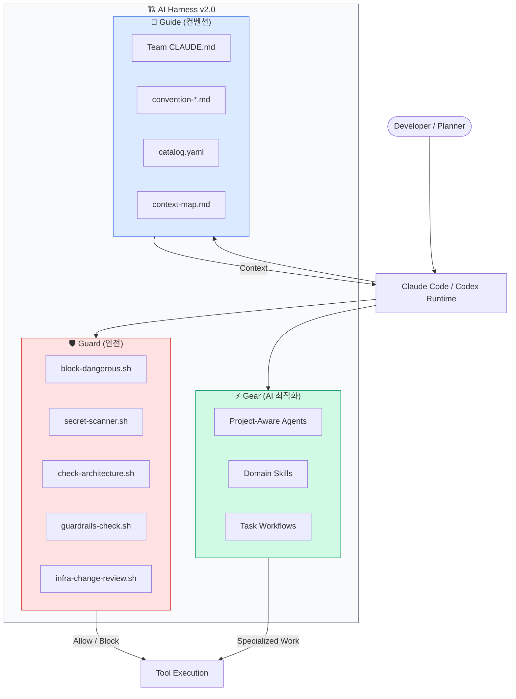
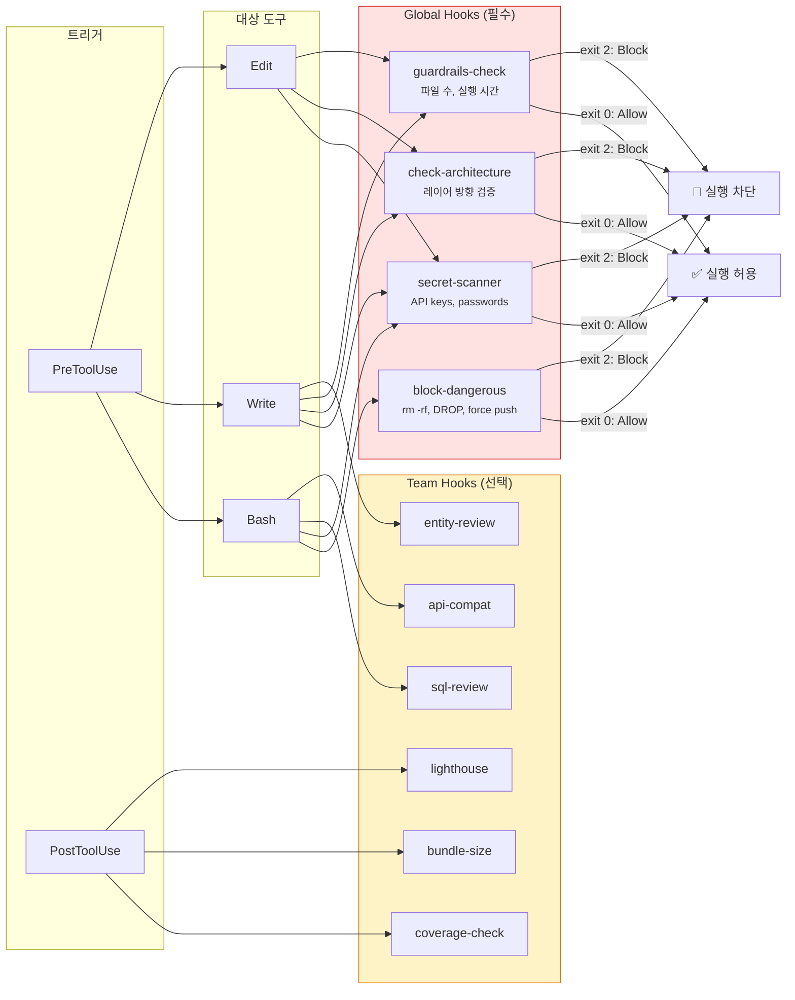
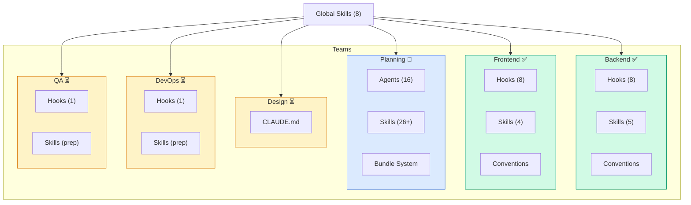
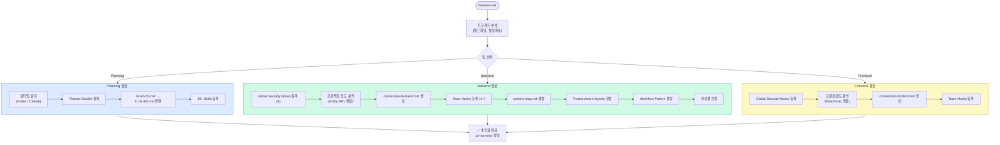
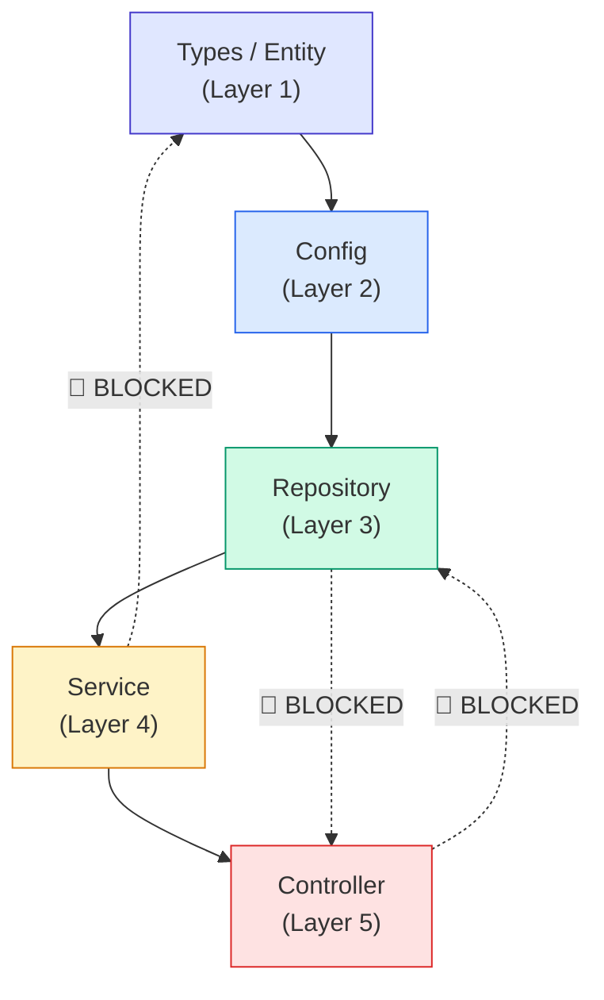
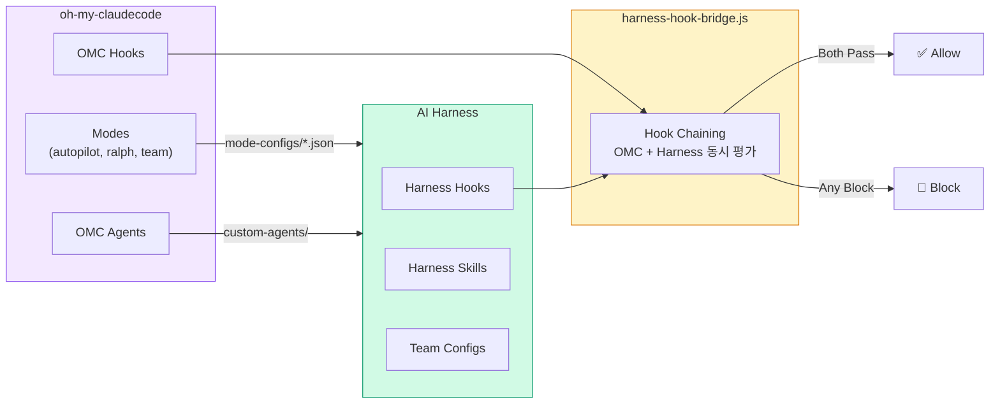
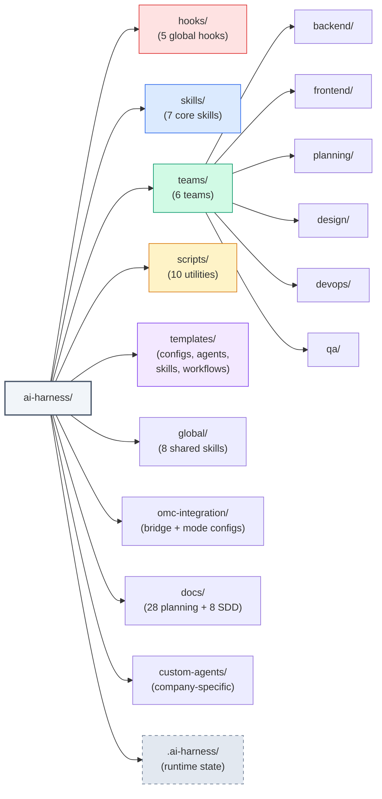
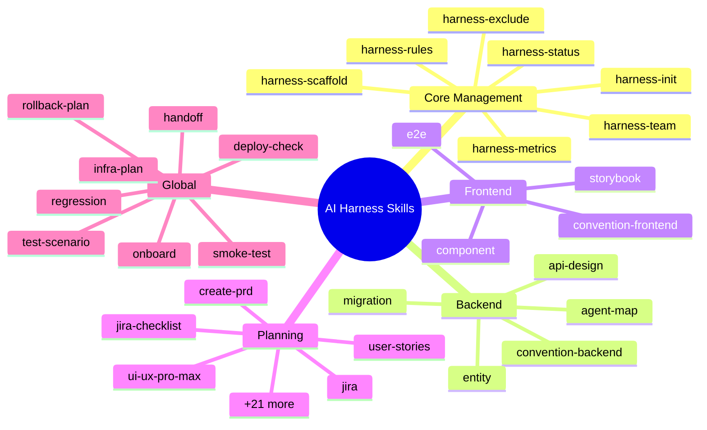

# AI Harness - Architecture Visualization

> Generated: 2026-03-31

## 1. Three-Pillar Architecture (전체 개요)

## 2. Hook System (실행 흐름)

## 3. Team Structure (팀 구성)

## 4. Init Flow (초기화 흐름)

## 5. Architecture Layer Enforcement (레이어 규칙)

## 6. OMC Integration (oh-my-claudecode 연동)

## 7. 파일 구조 요약

## 8. Skills 카탈로그

